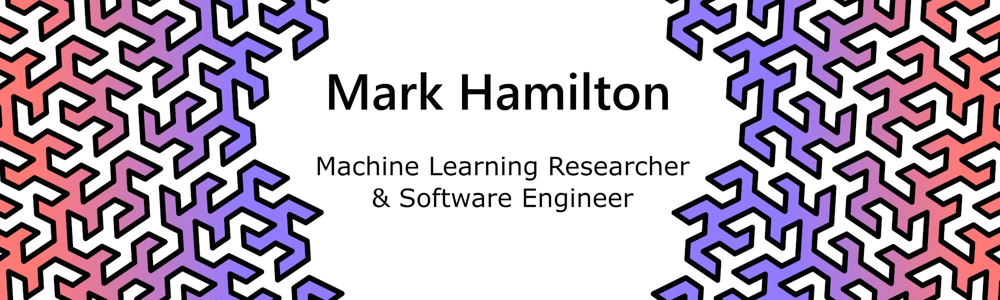

<h3>Open source projects</h3>
<table>
  <thead align="center">
    <tr border: none;>
      <td><b>🎁 Projects</b></td>
      <td><b>⭐ Stars</b></td>
      <td><b>🍴 Forks</b></td>
      <td><b>📬 Pull requests</b></td>
    </tr>
  </thead>
  <tbody>
    <tr>
      <td><a href="https://github.com/Azure/mmlspark"><b>SynapseML</b></a></td>
      <td></td>
      <td></td>
      <td></td>
    </tr>
    <tr>
      <td><a href="https://github.com/mhamilton723/FeatUp"><b>FeatUp: Improve the resolution of ANY vision model by 16-32x</b></a></td>
      <td></td>
      <td></td>
      <td></td>
    </tr>
    <tr>
      <td><a href="https://github.com/ShadeAlsha/ICon"><b>I-Con: A Unifying Framework for Representation Learning</b></a></td>
      <td></td>
      <td></td>
      <td></td>
    </tr>
    <tr>
      <td><a href="https://github.com/mhamilton723/DenseAV"><b>DenseAV: Unsupervised Discovery and Localization of Sound and Language</b></a></td>
      <td></td>
      <td></td>
      <td></td>
    </tr>
    <tr>
      <td><a href="https://github.com/mhamilton723/STEGO"><b>STEGO: Unsupervised Semantic Segmentation</b></a></td>
      <td></td>
      <td></td>
      <td></td>
    </tr>
    <tr>
      <td><a href="https://github.com/microsoft/art"><b>MosAIc</b></a></td>
      <td></td>
      <td></td>
      <td></td>
    </tr>
    <tr>
      <td><a href="https://github.com/microsoft/GenStudio"><b>Gen Studio</b></a></td>
  <td></td>
      <td></td>
      <td></td></td>
    </tr>
  </tbody>
</table>

